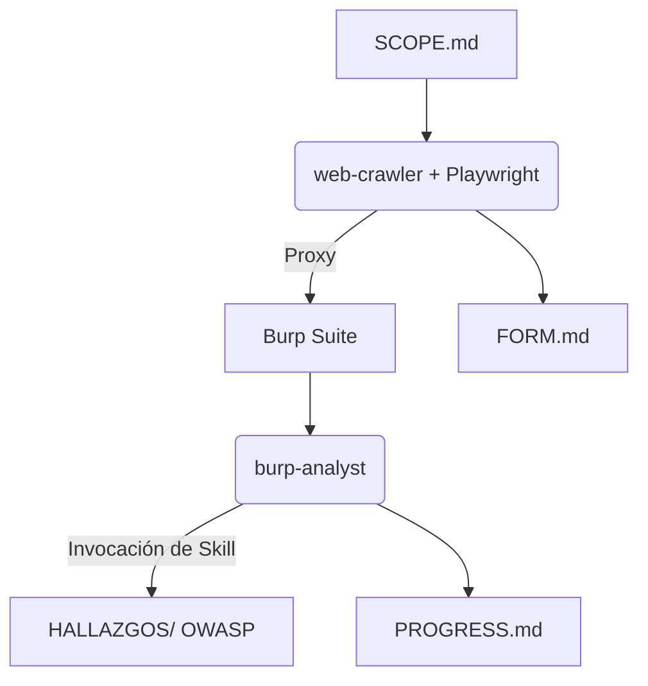

# Más allá del prompt: Agentes especializados para Pentesting con MCP y Burp Suite

> [!NOTE]
> **Repositorio Oficial de la Charla:** Este proyecto contiene todo el material, arquitectura y código presentado en el **ThreatX Meetup**. 

Este proyecto implementa un entorno de Red Team y auditoría web automatizado y modular, orquestado por Claude Code y potenciado por el Model Context Protocol (MCP). El ecosistema utiliza agentes de Inteligencia Artificial con roles especializados y manuales técnicos dinámicos (Skills) para interactuar de forma segura y transparente con herramientas del sistema operativo, navegadores proxyficados y suites de seguridad.

---

## Material de la Charla
* 🖥️ **Presentación Oficial (PDF):** puedes descargar las diapositivas completas de la presentación directamente desde el archivo [`Burp Suite con MCP y Claude Code - ThreatX Meetup.pdf`](./Burp%20Suite%20con%20MCP%20y%20Claude%20Code%20-%20ThreatX%20Meetup.pdf) en la raíz de este repositorio.

---

## Arquitectura del Sistema
El espacio de trabajo está dividido en componentes de identidad (Agentes), procedimientos (Skills) y archivos de estado que actúan como la memoria compartida del equipo de IA.

```text
.
├── .claude/
│   ├── agents/           # Configuración e identidad de los agentes (web-crawler, burp-analyst, etc.)
│   ├── skills/           # Manuales técnicos y estándares de procedimiento (Vulnerability Reporting)
│   └── agent-memory/     # Persistencia nativa indexada de cada agente entre sesiones
├── CLAUDE.md             # Directivas globales de comportamiento, ética y gobernanza del entorno
├── SCOPE.md              # Fuente de verdad indiscutible: Objetivos autorizados (Scope)
├── PROGRESS.md           # Registro secuencial global de actividades de los agentes
├── FORM.md               # Inventario dinámico de formularios y vectores de ataque detectados
└── HALLAZGOS/            # Repositorio de vulnerabilidades identificadas y aisladas en formato OWASP
```

## Conceptos Básicos: ¿Qué es un Agente, una Skill y un MCP?

Para entender cómo funciona este entorno, es importante diferenciar los tres pilares del ecosistema de IA actual:

* **Agente (Quién):** es la entidad de IA con un rol, personalidad y límites específicos. En lugar de tener un "Chatbot general", tenemos un agente configurado exclusivamente para ser un `web-crawler` y otro para ser un `burp-analyst`. Esto optimiza el contexto y mejora la precisión de las tareas.
* **Skill (Cómo):** son los manuales de procedimiento, instrucciones rígidas o scripts intermedios que los agentes cargan en memoria bajo demanda. Le enseñan al agente *cómo* estructurar un reporte o *cómo* mapear un formulario de manera estandarizada.
* **MCP - Model Context Protocol (Con qué):** es el protocolo abierto que actúa como los "sentidos y manos" de la IA. Permite que Claude Code se conecte de forma segura a herramientas externas del sistema operativo (como el sistema de archivos, un navegador automatizado o el proxy de Burp Suite).

## Componentes Clave
1. Agentes Especializados (.claude/agents/)
Entidades de IA configuradas con una personalidad y un alcance operativo estrictamente delimitado para evitar la dilución del foco y optimizar tokens:
- web-crawler: crawler automatizado mediante el MCP de Playwright. Navega de forma recursiva inyectando todo el tráfico a través del proxy para poblar el historial de Burp Suite.
- burp-analyst: analista pasivo encargado de escanear cabeceras, cuerpos y respuestas de Burp Suite para identificar pilas tecnológicas y fugas de información.

2. Manuales de Procedimiento (.claude/skills/)
Instrucciones procedimentales y estructuras rígidas que los agentes invocan bajo demanda para estandarizar entregables:
- vulnerability-reporting: gestiona de forma autónoma el file system, calcula la numeración secuencial de los hallazgos y obliga al agente a redactar bajo la estructura técnica de OWASP dentro de la carpeta HALLAZGOS/.
- form-mapping: centraliza el formato de captura de los puntos de entrada interactivos descubiertos en FORM.md.

## Prerrequisitos
Antes de comenzar, asegúrate de tener instalado en tu sistema:
* **Java JRE/JDK** (Para el conector de Burp Suite).
* **Node.js** (Versión LTS recomendada, incluye `npx`).
* **Burp Suite Professional / Community** configurado y escuchando.
* **Extensión MCP Server para Burp Suite** descargada y lista para ser ejecutada como servidor MCP.
* **Claude Code** con acceso al Model Context Protocol (MCP) para ejecutar los servidores necesarios.

## Configuración del Entorno (MCP Configuration)

Para que Claude Code pueda interactuar con Burp Suite y tu sistema operativo, debes configurar el archivo de control de MCP (típicamente ubicado en la configuración global de Claude Code o en el directorio del proyecto).

A continuación se detalla la estructura del archivo y **los parámetros que debes personalizar** para tu entorno local:

### Estructura de `.mcp.json`

| Servidor MCP | Función en este Proyecto                                                                    | Parámetros Clave a Modificar                   |
| :----------- | :------------------------------------------------------------------------------------------ | :--------------------------------------------- |
| `burp`       | Conecta la IA con la API de Burp Suite para analizar el tráfico de red de forma pasiva.     | Ruta del `.jar` del conector intermedio.       |
| `playwright` | Permite a la IA controlar un navegador web real e inyectar el tráfico en el proxy.          | Puerto del proxy local (ej: `8080` para Burp). |
| `filesystem` | Concede permisos controlados a la IA para escribir los reportes en la carpeta `HALLAZGOS/`. | Ruta del directorio del espacio de trabajo.    |

### Detalle del Archivo de Configuración (`.mcp.json`)

Se deben reemplazar las rutas absolutas (`/TU_RUTA_LOCAL/...`) según el sistema operativo anfitrión.

```json
{
  "mcpServers": {
    "burp": {
      "command": "/usr/bin/java",
      "args": [
        "-jar",
        "/TU_RUTA_LOCAL/mcp-proxy.jar",
        "--sse-url",
        "http://127.0.0.1:9876" 
      ]
    },
    "playwright": {
      "command": "npx",
      "args": [
        "-y",
        "@playwright/mcp@latest",
        "--proxy-server=http://127.0.0.1:8080",
        "--ignore-https-errors"
      ]
    },
    "filesystem": {
      "command": "npx",
      "args": [
        "-y",
        "@modelcontextprotocol/server-filesystem",
        "/TU_RUTA_LOCAL/DEL_PROYECTO"
      ]
    }
  }
}
```

> [!IMPORTANT]
> Las rutas en sistemas Windows deben utilizar doble barra invertida (ej: C:\\Users\\Usuario\\...) o barras simples hacia adelante (C:/Users/Usuario/...).

## Flujo de Trabajo Operativo


1. Definición del Alcance: el operador humano define los objetivos autorizados exclusivamente en SCOPE.md.
2. Mapeo Pasivo: se ejecuta web-crawler para que recorra el sitio de forma proxyficada. El tráfico legítimo e interactivo alimenta el historial de Burp Suite, mientras que el agente documenta los vectores de entrada en FORM.md.
3. Análisis de Infraestructura: el agente burp-analyst procesa los logs de tráfico para clasificar tecnologías y severidades.
4. Documentación Aislada: al detectar una vulnerabilidad, el agente en ejecución invoca la skill correspondiente, calcula el ID incremental (ej: 1_XSS_Reflejado.md) y lo confina en la carpeta HALLAZGOS/ con sus respectivas evidencias HTTP raw.
5. Sincronización: cada agente reporta sus pasos usando técnicas de append en PROGRESS.md antes de finalizar su ejecución.

## Acerca del Autor

**Hugo Avila** - *Cybersecurity Consultant & Full Stack Developer* en **ArtsSec.com**.

* **LinkedIn:** [devhugoavila](https://linkedin.com/in/devhugoavila)
* **X (Twitter):** [@hugok2k](https://x.com/hugok2k)
* **Web:** [hugoavila.dev](https://hugoavila.dev)


> [!NOTE] 
> - Scope Lock: queda terminantemente prohibida cualquier interacción con activos que no estén explícitamente declarados en SCOPE.md.
> - No Destructivo: los agentes operan bajo la premisa de "solo descubrimiento e identificación". No se ejecutan pruebas de denegación de servicio (DoS), explotación destructiva ni fuerza bruta masiva sin autorización previa por escrito en el chat.
> - Evidencia Técnica: un hallazgo sin la captura de la petición y respuesta HTTP cruda correspondiente carece de validez dentro del marco de este framework.

> [!WARNING]
> El uso de estas herramientas con fines de ataque a infraestructuras sin autorización previa es ilegal. Este repositorio tiene fines exclusivamente educativos y de auditoría ética. El autor no se hace responsable del mal uso de esta información.
